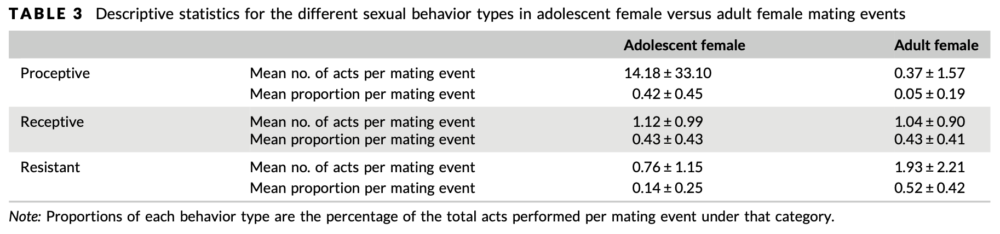

```{r, echo = FALSE, fig.align = 'center'}
knitr::include_graphics("https://orangutan.com/wp-content/uploads/2010/11/knott1.jpg")
```

# Introduction

### Background
I am replicating the data analyses from O'Connell et al. (2019), titled "Sociosexual behavioral patterns involving nulliparous female orangutans (Pongo sp.) reflect unique challenges during the adolescent period". Orangutans have the slowest life history of all great apes. This comes with a long period of adolescent development that lasts between 6-9 years. Because orangutans are semi-solitary with high levels of sexual coercion, adolescent females experience a unique set of challenges as they become more independent. 

The purpose of this study was to determine whether adolescent female orangutans employ different mating strategies from adult female orangutans. More specifically, this paper aimed to test if there is a difference in the degree of proceptivity (quantified by mating score) between adolescent and adult females. They predicted that adolescent females will display more proceptive behavior and less frequent resistant mating behavior compared to adult females.

### Methods
The study was conducted over a one year period in Gunung Palung National Park, West Kalimantan, Indonesia. Behavioral data on social and mating interactions were collected during this time period and analyzed alongside behavioral data from the long term database (1994-2014). The sample size included 11 adolescent females, 8 adult females, 8 flanged males, and 17 unflanged males. Whenever a mating event took place, the IDs of the actors and recipients, duration of the mating event, and types of behaviors were recorded. Mating behaviors were classified as being either proceptive, receptive, or resistant depending on the combination of observed behaviors observed during the mating event (see Table 2 below).

```{r table 2, echo=FALSE}
knitr::include_graphics("Table2_MatingScore.png")
```

### Replication project steps
O'Connell et al. (2019) conducted their analyses with SPSS 25. I will be attempting to replicate their results in R via the following steps: <br>
  1. Clean and load the data <br>
  2. Calculate descriptive statistics for mating score, mating duration, and mating behavior types for adolescent and adult females. <br>
  3. Plot the relationship between female age class (adolescent and adult) and mating score. This will be done by creating a boxplot with {ggplot2}. <br>
  4. Use generalized linear mixed models (GLMM) with ordinal distribution to predict mating score. I will be using the clmm() function in the {ordinal} package. I will also compare my model against those containing interaction effects with likelihood ratio tests. <br>

# Preliminaries
Here are the packages I'll be using:
```{r prelim packages, message=FALSE}
library(curl)
library(tidyverse)
library(DescTools) # descriptive stats
library(ggsignif) # data visualization
library(ordinal) # glmms for ordinal data
```

I cleaned up the data in Excel before importing it into R. The original Excel file contained a lot of annotations, sheets with calculations, and columns with notes that weren't relevant to this replication. I copied the relevant columns into a new Excel sheet, converted it into a csv file, and saved them to my repository. <br><br>
Here, I am loading the csv file into R and previewing its columns. O'Connell et al. (2019) didn't mention what to do with NA values so I removed them from the dataset. I also converted strings to factors.
```{r prelim load data}
f <- curl("https://raw.githubusercontent.com/samanthavee/svee-data-replication-assignment/main/Cleaned_MatingData_OConnelletal2019.csv")
matingdata <- read.csv(f, header = TRUE, sep = ",", stringsAsFactors = TRUE)
matingdata <- na.omit(matingdata)
head(matingdata)
```
- **female_class** indicates whether the female is an adolescent (1) or adult (2). <br>
- **male_class** indicates whether the male is unflanged (1) or flanged (2). <br>
- **mating_score** is an ordinal variable that describes whether females were resistant (1-2), receptive (3-7), or proceptive (8-10) during a mating event. These scores are classified in the column **mating_behavior**. 

# Descriptive statistical analysis
O'Connell et al. (2019) calculated descriptive statistics for mating score (mean, median, mode), mating duration (mean, median), and mating behavior types (mean, range) for adolescent and adult females.

First I need to separate the data for adolescent and adult females.
```{r filter females}
adultF_data <- matingdata[matingdata$female_class == 2, ]
length(adultF_data$femaleID)
adolescentF_data <- matingdata[matingdata$female_class == 1, ]
length(adolescentF_data$femaleID)
```

### Mating score
I am calculating the mean, median, and mode of mating score by adult and adolescent females. I used the {DescTools} package to calculate mode since there is no base R function that will do this. <br>
```{r descr mating score}
# adult 
adult_ms_mean <- mean(adultF_data$mating_score)
adult_ms_med <- median(adultF_data$mating_score)
adult_ms_mode <- Mode(adultF_data$mating_score)
adult <- list(Mean = as.numeric(adult_ms_mean), Median = as.numeric(adult_ms_med), Mode = as.numeric(adult_ms_mode))

# adolescent
adol_ms_mean <- mean(adolescentF_data$mating_score)
adol_ms_med <- median(adolescentF_data$mating_score)
adol_ms_mode <- Mode(adolescentF_data$mating_score)
adolescent <- list(Mean = as.numeric(adol_ms_mean), Median = as.numeric(adol_ms_med), Mode = as.numeric(adol_ms_mode))

# bind
ms <- rbind(adult, adolescent); ms
```

- The mean mating score for adolescent females is higher than adult females. However, both values fall within the range of receptive behaviors, according to table 2. <br>
- O'Connell et al. (2019) reports that "adolescent females had a mean mating score of 7.4 ± 2.5 (median = 8, mode = 10, range = 2–10), whereas adult females (N=8) had a mean mating score of 3.3±2.0 (median=2, mode=2, range = 1–9). The mean adolescent female sexual contact duration was 854 ± 285 s, whereas the mean adult female duration was 486 ± 65 s." <br>
- My values don't match the published results. I ended up going back to the original dataset, where it seemed like the descriptive stats were calculated in Excel instead of SPSS. The data was manually pasted into a separate Excel page and descriptive stats were calculated using the built in Excel function. Each pasted chunk for adults and adolescents is missing 3 entries (excluding NAs), which explain why my values differ. It's unclear whether these data points were accidentally or deliberately excluded.

### Mating duration
I am calculating the mean and median of mating duration by adult and adolescent females. <br>
```{r descr mating duration}
# adult
adult_md_mean <- mean(adultF_data$mating_duration)
adult_md_med <- median(adultF_data$mating_duration)
Adult <- list(Mean = as.numeric(adult_md_mean), Median = as.numeric(adult_md_med))

# adolescent
adol_md_mean <- mean(adolescentF_data$mating_duration)
adol_md_med <- median(adolescentF_data$mating_duration)
Adolescent <- list(Mean = as.numeric(adol_md_mean), Median = as.numeric(adol_md_med))

# bind
md <- rbind(Adult, Adolescent); md
```

- The mean mating duration is longer for adolescent females than adult females. <br>
- O'Connell et al. (2019) reports that "the mean adolescent female sexual contact duration 854 ± 285 s, whereas the mean adult female duration was 486 ± 65 s". <br>
- They did not report the median even though section 2.5 of the Methods notes that median of mating duration was calculated. <br>
- I experienced a similar problem with the first part of calculating the descriptive stats where my calculated means are slightly different from the reported means, which may be due to missing data. <br>

### Mating behavior type
O'Connell et al. (2019) don't specify how this was calculated so I am doing what feels most intuitive to me. I am classifying mating scores from 1-2 as resistant, 3-7 as receptive, and 8-10 as proceptive. This is based off Table 2 from the paper.

I am using {dyplyr} to create smaller data frames for each mating behavior type for adolescent and adult females.
```{r filter mating score}
# adults
adult_resist <- adultF_data[adultF_data$mating_behavior == "resistant", ]
adult_rec <- adultF_data[adultF_data$mating_behavior == "receptive", ]
adult_proc <- adultF_data[adultF_data$mating_behavior == "proceptive", ]

# adolescents
adol_resist <- adolescentF_data[adolescentF_data$mating_behavior == "resistant", ]
adol_rec <- adolescentF_data[adolescentF_data$mating_behavior == "receptive", ]
adol_proc <- adolescentF_data[adolescentF_data$mating_behavior == "proceptive", ]
```

Now I am going to start by calculating the mean for each mating behavior type.
```{r descr mating behavior type}
# adults
adult_resist_mms <- mean(adult_resist$mating_score) # resistant
adult_rec_mms <- mean(adult_rec$mating_score) # receptive
adult_proc_mms <- mean(adult_proc$mating_score) # proceptive

# adolescents
adol_resist_mms <- mean(adol_resist$mating_score) # resistant
adol_rec_mms <- mean(adol_rec$mating_score) # receptive
adol_proc_mms <- mean(adol_proc$mating_score) # proceptive

# mean
Adult <- list(Resistant = as.numeric(adult_resist_mms), 
              Receptive = as.numeric(adult_rec_mms), 
              Proceptive = as.numeric(adult_proc_mms))
Adolescent <- list(Resistant = as.numeric(adol_resist_mms), 
                   Receptive = as.numeric(adol_rec_mms), 
                   Proceptive = as.numeric(adol_proc_mms))
mean_score <- rbind(Adult, Adolescent); mean_score
```

As you can see, I initially used {dyplyr} to create smaller data frames for each mating behavior type for adolescent and adult females and then calculated the mean for each. However, looking at the final output for mean mating behavior helped me realize that my approach was incorrect. My calculated means will only fall between the range I constructed for each mating behavior type (resistant 1-2; receptive 3-7; proceptive 8-10). Table 3 (below) indicates that the mean describes the *number of acts* per mating event. My dataset only contains data about types of acts, not number of acts, which is what I need to calculate this descriptive statistic. I was not able to move forward with this part of the analysis since I don't have access to this data.

```{r table 3, echo=FALSE}

```

# Data visualization
I will be replicating the following figure from this paper using {ggplot2}:
```{r fig 2, echo=FALSE}
knitr::include_graphics("Fig2boxplot.png")
```

When I initially ran the code to make the plot, I received an error message because Female Class was an integer-type vector containing 1s and 2s. I needed to group them into Adult and Adolescent rather than numbers so I created a new factor-type vector that labeled the 1s and 2s according to their age class and added it to the original dataset. <br>
```{r ggplot prelim}
female_class_labels <- c("Adolescent", "Adult")
factor_female_class <- factor(matingdata$female_class, levels = 1:2, labels = female_class_labels)
matingdata$factor_female_class <- factor_female_class #added new vector to original dataset
head(matingdata)
```

```{r boxplot, warning=FALSE}
fig2 <- ggplot(data = matingdata, aes(x = factor_female_class, y = mating_score, 
                                      fill = factor_female_class)) + 
              geom_boxplot(na.rm = TRUE, show.legend = FALSE) + 
              xlab("Female Class") + ylab("Mating Score") + 
              scale_y_continuous(breaks = seq(0, 10, by = 2)) + 
              theme_bw() + 
              geom_signif(comparisons = list(c("Adult", "Adolescent")), map_signif_level=TRUE) +
              scale_fill_manual(breaks = c("Adult", "Adolescent"), values = c("white", "grey"))
fig2
```

As you can see, my boxplot looks pretty identical to one from the paper! I used the package {ggsignif} to add the stars for significance to the boxplot. There is a significant difference in mating scores between adolescent and adult females. It looks like adolescent females have higher mating scores than adult females, suggesting that they are more receptive and proceptive during mating events. 

# GLMM with ordinal data
O'Connell et al. (2019) used a generalized linear mixed model (GLMM) with an ordinal distribution to predict the mating score. The outcome of interest, mating score, is an ordinal variable with 1 being fully resistant and 10 being fully proceptive. The types of behaviors exhibited at each level is described in Table 2 (above).

They also note that only mating events of females who were potentially cycling (not pregnant or lactating) were included. I used {dyplr} to filter out the data and push data for cycling females into a new data frame. 
```{r keep cycling females}
glmm_data <- matingdata[matingdata$reprod_status == "cycling", ]
summary(glmm_data$reprod_status) # it worked! 
```


## Exploratory data analysis
Before jumping directly into the model, I want to explore the data and plot some variables.
```{r glmm eda}
head(glmm_data)
summary(glmm_data)
class(glmm_data$mating_score)
```

```{r hist}
hist(glmm_data$mating_score)
```

The class for the mating score variable is currently integer but it needs to be a factor since each number from 1-10 represents a different level of proceptivity. This is important for making the GLMM with ordinal data later on.
```{r change class}
glmm_data$mating_score <- as.factor(glmm_data$mating_score)
class(glmm_data$mating_score)
```

I previously plotted female class and mating score but I want to visualize other aspects of the data so I will try plotting female class and mating duration.
```{r eda plot1}
plot(data = glmm_data, mating_duration ~ factor_female_class, col = c("orange"))
```

One adolescent female in particular had a very long mating event. Looking at the rest of the bars, it looks like adolescent females have slightly higher mating duration than adult females?

I also want to plot male class and mating duration. Before I do that, I need to create a new column where male class is a factor.
```{r eda plot2}
male_class_labels <- c("Unflanged", "Flanged")
factor_male_class <- factor(glmm_data$male_class, levels = 1:2, labels = male_class_labels)
glmm_data$factor_male_class <- factor_male_class 
plot(data = glmm_data, mating_duration ~ factor_male_class, col = c("orange"))
```

It looks like there's a greater range of mating duration for flanged males. They also have the highest mating duration, which makes sense given what we know about flanged males.

## Creating the GLMM
O'Connell et al. (2019) use GLMMs with an ordinal distribution to predict the mating score. Because my dependent/response variable, mating score, has an ordinal distribution, I will be using the clmm() function from the {ordinal} package.

The paper specifies that fixed effects include female class (adolescent or adult), mating duration, and male class (flanged or unflanged). Female and male IDs were used as random effects to account for repeated measures from the same individual.

Furthermore, O'Connell et al. (2019) state that, "using the GLMMs to predict mating score, all combinations of possible two-way interaction effects were tested and subsequently omitted from the final model, as none of the interactions were significant". To confirm this, I will run likelihood ratio tests to compare models containing interaction effects between fixed effects. I am testing the probability of actually seeing this collected data given a particular model. 

I started by using relevel() to change the baseline group to match the output shown in the paper.
```{r relevel}
glmm_data$factor_female_class <- relevel(glmm_data$factor_female_class, ref = "Adult")
glmm_data$factor_male_class <- relevel(glmm_data$factor_male_class, ref = "Flanged")
```

Next I created a full model without any interaction effects.
```{r glmm}
full <- clmm(data = glmm_data, mating_score ~ factor_female_class + factor_male_class + mating_duration + (1|femaleID) + (1|maleID))
summary(full)
```

### Model selection
The values in the model summary did not match those from the paper, which made me wonder if O'Connell et al. (2019) used a different link function. They did not specify which link function they used for their GLMM but the clmm() function applies a default logit-link function. Other available link functions are probit, log-log (negative log-log), clog-log (complementary log-log), and cauchit. 

Christensen (2011) selected the most appropriate link function for their model by comparing the log-likelihood of models with different link functions and selecting the model with the highest log-likelihood. I did the same with my model. I disregarded the model with the 'cauchit' link function because it returned an error message that said "Model is nearly unidentifiable: large eigenvalue ratio".
```{r}
probit <- clmm(data = glmm_data, link = c("probit"), mating_score ~ factor_female_class + factor_male_class + mating_duration + (1|femaleID) + (1|maleID))
probit$logLik

loglog <- clmm(data = glmm_data, link = c("loglog"), mating_score ~ factor_female_class + factor_male_class + mating_duration + (1|femaleID) + (1|maleID))
loglog$logLik

cloglog <- clmm(data = glmm_data, link = c("cloglog"), mating_score ~ factor_female_class + factor_male_class + mating_duration + (1|femaleID) + (1|maleID))
cloglog$logLik
```
The 'cloglog' (complementary log-log) link function returns the highest log-likelihood value so I will use this model moving forward. I think using this link function makes sense because [...]

However, Christensen (2011) stated that the log-log link function was appropriate for variables with a right skew distribution, which I saw in the histogram for mating score. Smith & McKenna (2012) and this link (https://bookdown.org/chua/ber642_advanced_regression/ordinal-logistic-regression.html) also suggest that the choice of link function used in an ordinal regression depends on the distribution of the ordinal outcome, in which the log-log link function is used when smaller categories or values are more probable.
```{r cloglog}
summary(cloglog)
```

I will move forward with this model and compare it to those with interaction effects.

### Interaction effects
The fixed effects are female class, male class, and mating duration. There are 3 possible ways to create two-way interaction effects: 1) female class * male class, 2) male class * mating duration, and 3) mating duration * female class. I created models with these different interaction effects.
```{r female x male}
# female class * male class
int1 <- clmm(data = glmm_data, mating_score ~ factor_female_class * factor_male_class + mating_duration + (1|femaleID) + (1|maleID))
summary(int1)
```

```{r male x mating duration}
# male class * mating duration
int2 <- clmm(data = glmm_data, mating_score ~ factor_female_class + factor_male_class * mating_duration + (1|femaleID) + (1|maleID))
summary(int2)
```

```{r mating duration x female}
# mating duration * female class
int3 <- clmm(data = glmm_data, mating_score ~ factor_female_class * mating_duration + factor_male_class + (1|femaleID) + (1|maleID))
summary(int3)
```

### Model comparisons
I'm comparing each model containing interactions effects against the full model without interaction effects. The {ordinal} package includes an anova() function that performs likelihood ratio tests from the clmm() function output.
```{r comparing models}
anova(cloglog, int1)
anova(cloglog, int2)
anova(cloglog, int3)
```
int2 and int3 are significant but i didn't include REML = FALSE in models like we did in modules. clmm doesn't recognize it but also don't know what kind of maximum likelihood ordinal package anova is doing. 

messing around, trying AICc, but am i even supposed to be doing this? int2 also has lowest AIC value
https://www.scribbr.com/statistics/akaike-information-criterion/
```{r AICc}
library(AICcmodavg)
print(aictab(list(cloglog, int1, int2, int3), c("cloglog", "int1", "int2", "int3")))
```

## Interpreting GLMM
discuss glmm results from replication and how they compare to original paper

# Final reflections
Overall, [...] <br>

I received the raw data from the first author because it was not originally publically available. Because of this, the raw data file contained a lot of additional comments and columns that were not directly relevant to the analyses conducted in the paper. I cleaned up the data on my own and only included columns that I thought would be necessary. As I began working with the data in R, I realized that I had to do a lot of additional formatting to make the data compatible with the packages (e.g. renaming age class vector and changing it to a factor). This played a big role in some of the discrepancies between my results and what was published in the paper! [...]

# References
Christensen, R. H. B. (2011). Analysis of ordinal data with cumulative link models—estimation with the R-package ordinal. R-package version, 28, 406.

Christensen, R. H. B. (2018). Cumulative link models for ordinal regression with the R package ordinal. Submitted in J. Stat. Software, 35.

O'Connell, C. A., Susanto, T. W., & Knott, C. D. (2020). Sociosexual behavioral patterns involving nulliparous female orangutans (Pongo sp.) reflect unique challenges during the adolescent period. American Journal of Primatology, 82(11), e23058.

Smith, T. J., & McKenna, C. M. (2012). An examination of ordinal regression goodness-of-fit indices under varied sample conditions and link functions. Multiple Linear Regression Viewpoints, 38(1), 1-7.
