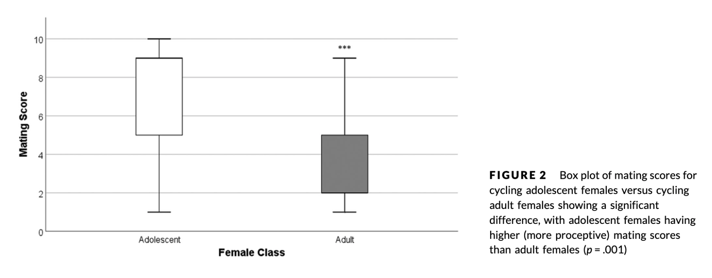

# Introduction
I am replicating the data analyses from O'Connell et al. (2019), titled "Sociosexual behavioral patterns involving nulliparous female orangutans (Pongo sp.) reflect unique challenges during the adolescent period". This paper was originally analyzed and visualized with SPSS but I will be attempting to recreate this in R! 

Orangutans have the slowest life history of all great apes! This comes with a long period of adolescent development that lasts between 6-9 years. Because orangutans are semi-solitary with high levels of sexual coercion, adolescent females experience a unique set of challenges as they become more independent. The purpose of this study was to determine whether adolescent female orangutans employ different mating strategies from adult female orangutans.

More specifically, this paper aimed to test if there is a difference in the degree of proceptivity (quantified by mating score) between adolescent and adult females. They predict that adolescent females will display more proceptive behavior and less frequent resistant mating behavior compared to adult females.

### Outline of methods replicated
We'll take the following steps to answer this question: <br>
  1. Load and clean the data <br>
  2. Calculate descriptive statistics for mating score, mating duration, and mating behavior types for adolescent and adult females <br>
  3. Use generalized linear mixed models (GLMM) with ordinal distribution to predict mating score

# Preliminaries
Here are the packages we'll be using
```{r prelim packages, message=FALSE}
library(curl)
library(tidyverse)
# what else?
```

Here is the data we'll be analyzing
```{r prelim load data}
# load data
# use str function to see what each variable is! 
```
- **female_class** indicates whether the female is an adult (1) or adolescent (2). <br>
- **male_class** indicates whether the male is unflanged (1) or flanged (2). <br>
- **mating_score** is an ordinal variable that describes whether females were resistant (1-2), receptive (3-7), or proceptive (8-10) during a mating event. These scores are classified in the column **mating_behavior**. 

# Descriptive statistical analysis
"Descriptive statistics were calculated for mating score (mean, median, mode) and mating duration (mean, median), and mating behavior types (mean, range) for adolescent and adult females."

# Data visualization
I will be replicating the following figure from this paper.
```{r fig 2, echo=FALSE}

```

[something here...]
```{r boxplot replication}

```

# Inferential statistical analysis

## Testing model assumptions
Test model assumptions!! 

## Creating GLMM
- GLMMs with ordinal distribution used to predict mating score
- Only mating events of females who were potentially cycling (not pregnant or lactating) were included
- Female class (adolescent or adult), mating duration, and male type (flanged or unflanged) used as fixed effects
- Female and male IDs used as random effects for account for repeated measures of same individual
