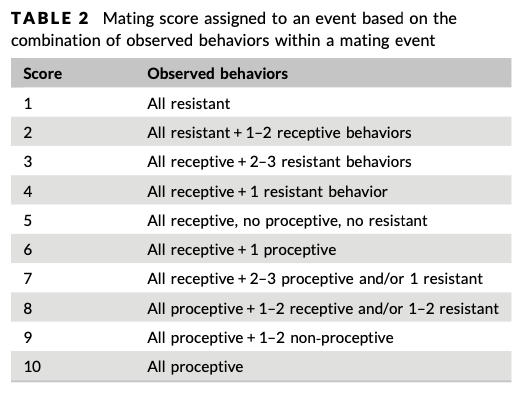

```{r, echo = FALSE, fig.align = 'center'}
knitr::include_graphics("https://orangutan.com/wp-content/uploads/2010/11/knott1.jpg")
```

# Introduction
I am replicating the data analyses from O'Connell et al. (2019), titled "Sociosexual behavioral patterns involving nulliparous female orangutans (Pongo sp.) reflect unique challenges during the adolescent period". This paper was originally analyzed and visualized with SPSS but I will be attempting to recreate this in R! 

Orangutans have the slowest life history of all great apes! This comes with a long period of adolescent development that lasts between 6-9 years. Because orangutans are semi-solitary with high levels of sexual coercion, adolescent females experience a unique set of challenges as they become more independent. The purpose of this study was to determine whether adolescent female orangutans employ different mating strategies from adult female orangutans.

More specifically, this paper aimed to test if there is a difference in the degree of proceptivity (quantified by mating score) between adolescent and adult females. They predict that adolescent females will display more proceptive behavior and less frequent resistant mating behavior compared to adult females.

### Outline of methods replicated
I took the following steps to answer this question: <br>
  1. Load and clean the data <br>
  2. Calculate descriptive statistics for mating score, mating duration, and mating behavior types for adolescent and adult females <br>
  3. Use generalized linear mixed models (GLMM) with ordinal distribution to predict mating score

# Preliminaries
Here are the packages we'll be using
```{r prelim packages, message=FALSE}
library(curl)
library(tidyverse)
library(DescTools)
library(ggsignif) #for data visualization
# what else?
```

I'm loading the data and previewing it. O'Connell et al. (2019) don't mention what to do with NA values so I removed them from the dataset.
```{r prelim load data}
f <- curl("https://raw.githubusercontent.com/samanthavee/svee-data-replication-assignment/main/Cleaned_MatingData_OConnelletal2019.csv")
matingdata <- read.csv(f, header = TRUE, sep = ",", stringsAsFactors = TRUE)
matingdata <- na.omit(matingdata)
head(matingdata)
```
- **female_class** indicates whether the female is an adolescent (1) or adult (2). <br>
- **male_class** indicates whether the male is unflanged (1) or flanged (2). <br>
- **mating_score** is an ordinal variable that describes whether females were resistant (1-2), receptive (3-7), or proceptive (8-10) during a mating event. These scores are classified in the column **mating_behavior**. <br><br>

For additional context behind categories for mating score, here is Table 2 from the paper:
```{r table 2, echo=FALSE}

```


# Descriptive statistical analysis
O'Connell et al. (2019) calculated descriptive statistics for mating score (mean, median, mode), mating duration (mean, median), and mating behavior types (mean, range) for adolescent and adult females.

First I need to separate the data for adolescent and adult females.
```{r filter females}
adultF_data <- matingdata[matingdata$female_class == 2, ]
length(adultF_data$femaleID)
adolescentF_data <- matingdata[matingdata$female_class == 1, ]
length(adolescentF_data$femaleID)
```

### Mating score
I am calculating the mean, median, and mode of mating score by adult and adolescent females. <br>
```{r descr mating score}
# adult 
adult_ms_mean <- mean(adultF_data$mating_score)
adult_ms_med <- median(adultF_data$mating_score)
adult_ms_mode <- Mode(adultF_data$mating_score)
adult <- list(Mean = as.numeric(adult_ms_mean), Median = as.numeric(adult_ms_med), Mode = as.numeric(adult_ms_mode))

# adolescent
adol_ms_mean <- mean(adolescentF_data$mating_score)
adol_ms_med <- median(adolescentF_data$mating_score)
adol_ms_mode <- Mode(adolescentF_data$mating_score)
adolescent <- list(Mean = as.numeric(adol_ms_mean), Median = as.numeric(adol_ms_med), Mode = as.numeric(adol_ms_mode))

# bind
ms <- rbind(adult, adolescent); ms
```

- The mean mating score for adolescent females is higher than adult females. However, both values fall within the range of receptive behaviors, according to table 2. <br>
- O'Connell et al. (2019) reports that "adolescent females had a mean mating score of 7.4 ± 2.5 (median = 8, mode = 10, range = 2–10), whereas adult females (N=8) had a mean mating score of 3.3±2.0 (median=2, mode=2, range = 1–9). The mean adolescent female sexual contact duration was 854 ± 285 s, whereas the mean adult female duration was 486 ± 65 s." <br>
- My values don't match the published results. I ended up going back to the original dataset, where I noticed that the descriptive stats were calculated in Excel. The data was manually pasted into a new Excel page and descriptive stats were calculated using the built in Excel function. Each pasted chunk for adults and adolescents is missing 3 entries (excluding NAs). 

### Mating duration
I am calculating the mean and median of mating duration by adult and adolescent females. <br>
```{r descr mating duration}
# adult
adult_md_mean <- mean(adultF_data$mating_duration)
adult_md_med <- median(adultF_data$mating_duration)
Adult <- list(Mean = as.numeric(adult_md_mean), Median = as.numeric(adult_md_med))

# adolescent
adol_md_mean <- mean(adolescentF_data$mating_duration)
adol_md_med <- median(adolescentF_data$mating_duration)
Adolescent <- list(Mean = as.numeric(adol_md_mean), Median = as.numeric(adol_md_med))

# bind
md <- rbind(Adult, Adolescent); md
```

- The mean mating duration is longer for adolescent females than adult females. <br>
- O'Connell et al. (2019) reports that "the mean adolescent female sexual contact duration 854 ± 285 s, whereas the mean adult female duration was 486 ± 65 s". <br>
- They did not report the median even though section 2.5 of the Methods notes that median of mating duration was calculated. <br>
- I experienced a similar problem with the first part of calculating the descriptive stats where my calculated means are slightly different from the reported means, which may be due to missing data. <br>

### Mating behavior type
- O'Connell et al. (2019) don't specify how this was calculated so I am doing what feels most intuitive to me. I am classifying mating scores from 1-2 as resistant, 3-7 as receptive, and 8-10 as proceptive. This is based off Table 2 from the paper.

I am using {dyplyr} to create smaller data frames for each mating behavior type for adolescent and adult females.
```{r filter mating score}
# adults
adult_resist <- adultF_data[adultF_data$mating_behavior == "resistant", ]
adult_rec <- adultF_data[adultF_data$mating_behavior == "receptive", ]
adult_proc <- adultF_data[adultF_data$mating_behavior == "proceptive", ]

# adolescents
adol_resist <- adolescentF_data[adolescentF_data$mating_behavior == "resistant", ]
adol_rec <- adolescentF_data[adolescentF_data$mating_behavior == "receptive", ]
adol_proc <- adolescentF_data[adolescentF_data$mating_behavior == "proceptive", ]
```

Now I can calculate the mean and range for each mating behavior type.
```{r descr mating behavior type}
# adults
mean(adult_resist$mating_score) # resistant
Range(adult_resist$mating_score)
mean(adult_rec$mating_score) # receptive
Range(adult_rec$mating_score)
mean(adult_proc$mating_score) # proceptive
Range(adult_proc$mating_score)

# adolescents
mean(adol_resist$mating_score) # resistant
Range(adol_resist$mating_score)
mean(adol_rec$mating_score) # receptive
Range(adol_rec$mating_score)
mean(adol_proc$mating_score) # proceptive
Range(adol_proc$mating_score)

# mean
Adult <- list(Resistant = as.numeric(mean(adult_resist$mating_score)), Receptive = as.numeric(mean(adult_rec$mating_score)), Proceptive = as.numeric(mean(adult_proc$mating_score)))
Adolescent <- list(Resistant = as.numeric(mean(adol_resist$mating_score)), Receptive = as.numeric(mean(adol_rec$mating_score)), Proceptive = as.numeric(mean(adol_proc$mating_score)))
mean_score <- rbind(Adult, Adolescent); mean_score

# this doesn't make sense, table 3 says they're mean number of acts per mating event. number of acts and type of acts make up mating score. i think i have data with mating score but i don't think caitlin sent me the data with the actual number of acts, she might have put this in a different file?
```


# Data visualization
I will be replicating the following figure from this paper using {ggplot2}:
```{r fig 2, echo=FALSE}
knitr::include_graphics("Fig2boxplot.png")
```

- When I initially ran the code to make the plot, I received an error message because Female Class was an integer-type vector containing 1s and 2s. I needed to group them into Adult and Adolescent rather than numbers so I created a new factor and added it to the original dataset. <br>
```{r ggplot prelim, results='hide'}
# creating and adding new vector to original dataset
female_class_labels <- c("Adult", "Adolescent")
factor_female_class <- factor(matingdata$female_class, levels = 1:2, labels = female_class_labels)
matingdata$factor_female_class <- factor_female_class #added new vector to original dataset
```

```{r boxplot, warning=FALSE}
fig2 <- ggplot(data = matingdata, aes(x = factor_female_class, y = mating_score, 
                                      fill = factor_female_class)) + 
              geom_boxplot(na.rm = TRUE, show.legend = FALSE) + 
              xlab("Female Class") + ylab("Mating Score") + 
              scale_y_continuous(breaks = seq(0, 10, by = 2)) + 
              theme_bw() + 
              geom_signif(comparisons = list(c("Adult", "Adolescent")), map_signif_level=TRUE) +
              scale_fill_manual(breaks = c("Adult", "Adolescent"), values = c("white", "grey"))
fig2
```

# Inferential statistical analysis
[...]

## Testing model assumptions
Test model assumptions!! 

## Creating GLMM
- GLMMs with ordinal distribution used to predict mating score
- Only mating events of females who were potentially cycling (not pregnant or lactating) were included
- Female class (adolescent or adult), mating duration, and male type (flanged or unflanged) used as fixed effects
- Female and male IDs used as random effects for account for repeated measures of same individual
